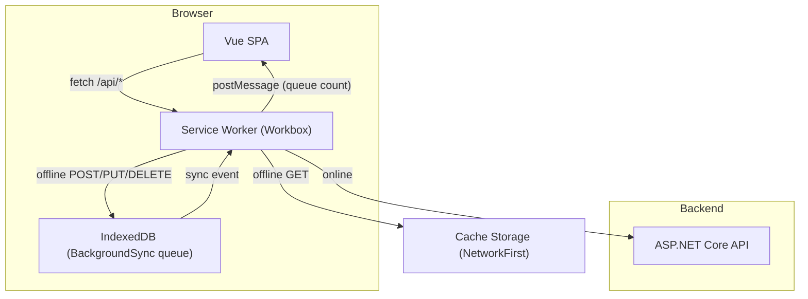

# PWA / офлайн для CigarHelper.Web

## Текущее состояние

- SPA на Vue 3 + Vite 7.3, PrimeVue, Tailwind 4
- Нет service worker, манифеста, иконок — `public/` пуст (нет даже favicon.ico)
- API-слой: единый Axios-экземпляр (`[src/services/api.ts](CigarHelper.Web/src/services/api.ts)`), JWT из localStorage, toast при ошибках сети
- Pinia не используется; состояние — реактивные синглтоны и composables
- 12 сервисных модулей (auth, cigars, humidors, reviews, dashboard, search, profile, admin, brands)

## Архитектура решения




## Стратегия: `vite-plugin-pwa` + `injectManifest`

- `injectManifest` даёт полный контроль над SW (runtime-кеширование, BackgroundSync)
- Workbox-модули — dev-зависимости, трешейкятся при сборке SW

### Стратегии кеширования


| Маршрут                                                                           | Метод           | Стратегия                          | Причина                              |
| --------------------------------------------------------------------------------- | --------------- | ---------------------------------- | ------------------------------------ |
| Build assets (JS/CSS/fonts)                                                       | GET             | **Precache**                       | Версионируются при сборке            |
| `/api/humidors`, `/api/cigars`, `/api/dashboard/`*, `/api/reviews`, `/api/brands` | GET             | **NetworkFirst** (TTL 1 hour)      | Часто меняются, но нужны офлайн      |
| `/api/cigars/bases/`*                                                             | GET             | **StaleWhileRevalidate** (TTL 24h) | Каталог, редко меняется              |
| `/api/cigar-images/*/thumbnail`, `/api/cigar-images/*/data`                       | GET             | **CacheFirst** (TTL 30d, max 200)  | Изображения практически иммутабельны |
| `/api/search`                                                                     | GET             | **NetworkOnly**                    | Поиск бессмысленен из кеша           |
| `/api/`*                                                                          | POST/PUT/DELETE | **NetworkOnly + BackgroundSync**   | Очередь мутаций при офлайне          |


### Ограничения BackgroundSync (честно)

- **Зависимые операции**: если пользователь создаёт хьюмидор офлайн (POST) и тут же добавляет в него сигару — второй запрос ссылается на ещё несуществующий `humidorId`. Workbox воспроизведёт оба по порядку, но второй упадёт с 404. **Решение в MVP**: предупреждение "Действие поставлено в очередь, результат появится после синхронизации"; при ошибке воспроизведения — уведомление пользователя.
- **JWT**: токен может истечь за время офлайна. SW перед replay проверит expiry и попросит re-login через postMessage, если токен мёртв.
- **Крупные тела (FormData с фото)**: BackgroundSync справляется, но при больших файлах есть риск квоты IndexedDB. Загрузки фото > 5 МБ блокируем с сообщением "Загрузите фото при подключении к сети".

## Шаги реализации

### Шаг 1 — Зависимости и иконки

- `npm i -D vite-plugin-pwa @vite-pwa/assets-generator workbox-precaching workbox-core workbox-routing workbox-strategies workbox-background-sync workbox-expiration`
- Создать SVG-логотип `public/logo.svg` (стилизованная сигара, rose-акцент, как в теме)
- `pwa-assets.config.ts` + скрипт `generate-pwa-assets` → favicon.ico, pwa-192x192.png, pwa-512x512.png, apple-touch-icon-180x180.png
- Обновить `[index.html](CigarHelper.Web/index.html)`: `<meta name="theme-color">`, `<link rel="apple-touch-icon">`

### Шаг 2 — Конфигурация `vite-plugin-pwa`

Файл: `[vite.config.js](CigarHelper.Web/vite.config.js)`

- Добавить `VitePWA({ strategies: 'injectManifest', srcDir: 'src', filename: 'sw.ts', registerType: 'prompt', manifest: { name, short_name, theme_color, icons, ... }, injectManifest: { globPatterns: ['**/*.{js,css,html,woff2,png,svg}'] } })`
- `registerType: 'prompt'` — покажем toast "Доступна новая версия" вместо тихого auto-update

### Шаг 3 — Custom Service Worker `src/sw.ts`

```typescript
import { precacheAndRoute, cleanupOutdatedCaches } from 'workbox-precaching'
import { registerRoute } from 'workbox-routing'
import { NetworkFirst, CacheFirst, StaleWhileRevalidate, NetworkOnly } from 'workbox-strategies'
import { BackgroundSyncPlugin } from 'workbox-background-sync'
import { ExpirationPlugin } from 'workbox-expiration'
import { clientsClaim } from 'workbox-core'

declare let self: ServiceWorkerGlobalScope

// Prompt for update
self.addEventListener('message', (event) => {
  if (event.data?.type === 'SKIP_WAITING') self.skipWaiting()
})
clientsClaim()

cleanupOutdatedCaches()
precacheAndRoute(self.__WB_MANIFEST)

// --- Runtime caching ---
// GET lists: NetworkFirst
registerRoute(
  ({ url }) => url.pathname.match(/^\/api\/(humidors|cigars|dashboard|reviews|brands)(\/|$)/),
  new NetworkFirst({ cacheName: 'api-lists', plugins: [new ExpirationPlugin({ maxAgeSeconds: 3600 })] }),
  'GET'
)
// ... CacheFirst для images, StaleWhileRevalidate для bases, BackgroundSync для мутаций
```

Полная реализация в файле; здесь — каркас.

### Шаг 4 — Регистрация SW и update-prompt

Файл: `[main.ts](CigarHelper.Web/src/main.ts)` — импортировать `registerSW` из `virtual:pwa-register` и вызвать.

Новый composable `src/composables/usePwaUpdate.ts`:

- Слушать `onNeedRefresh` от registerSW
- Показывать toast "Доступно обновление" с кнопкой "Обновить"

### Шаг 5 — Composable `useOnlineStatus`

Файл: `src/composables/useOnlineStatus.ts`

- `ref(navigator.onLine)` + listeners `online`/`offline`
- При переходе online → toast "Соединение восстановлено, синхронизация..."
- При переходе offline → toast "Вы офлайн. Изменения будут сохранены при восстановлении сети."

### Шаг 6 — Composable `usePendingSync`

Файл: `src/composables/usePendingSync.ts`

- Слушает postMessage от SW с типом `SYNC_STATUS` (count pending, sync complete, sync error)
- Реактивный `pendingCount: ref<number>`
- SW отправляет сообщение клиентам при enqueue / dequeue / ошибке

### Шаг 7 — UI: офлайн-баннер, значок очереди, кнопка установки

Файл: `[App.vue](CigarHelper.Web/src/App.vue)`

- Жёлтый баннер поверх контента при `!isOnline` ("Вы работаете офлайн")
- Badge на иконке в шапке при `pendingCount > 0` ("3 действия ожидают синхронизации")
- Composable `useInstallPrompt` + кнопка "Установить приложение" в меню/шапке (только когда `beforeinstallprompt` сработал)

### Шаг 8 — TypeScript config

Файл: `[tsconfig.json](CigarHelper.Web/tsconfig.json)` — добавить `"WebWorker"` в `compilerOptions.lib`

### Шаг 9 — Тесты

- Unit (Vitest): `useOnlineStatus.test.ts`, `useInstallPrompt.test.ts`, `usePendingSync.test.ts`, `usePwaUpdate.test.ts`
- Проверка сборки: `npm run build` должен генерировать `sw.js` + manifest в `dist/`
- E2E: smoke-проверка, что SW регистрируется (Playwright `page.evaluate(() => navigator.serviceWorker.controller)`)

### Шаг 10 — Документация и бэклог

- Обновить `[TODO.md](TODO.md)`: закрыть пункт PWA, добавить follow-up (Phase 2: app-level offline store)
- Обновить `[docs/memory-bank/frontend/workflow.md](docs/memory-bank/frontend/workflow.md)`: PWA-сборка, иконки, SW
- Обновить `[docs/memory-bank/frontend/code-map.md](docs/memory-bank/frontend/code-map.md)`: новые composables и sw.ts

## Новые файлы


| Файл                                                                                       | Назначение                        |
| ------------------------------------------------------------------------------------------ | --------------------------------- |
| `public/logo.svg`                                                                          | Исходный SVG для генерации иконок |
| `public/pwa-192x192.png`, `pwa-512x512.png`, `apple-touch-icon-180x180.png`, `favicon.ico` | Сгенерированные иконки            |
| `pwa-assets.config.ts`                                                                     | Конфиг генератора иконок          |
| `src/sw.ts`                                                                                | Custom Service Worker             |
| `src/composables/useOnlineStatus.ts`                                                       | Реактивный онлайн-статус          |
| `src/composables/usePendingSync.ts`                                                        | Счётчик ожидающих мутаций         |
| `src/composables/useInstallPrompt.ts`                                                      | Install-промпт                    |
| `src/composables/usePwaUpdate.ts`                                                          | Prompt for SW update              |


